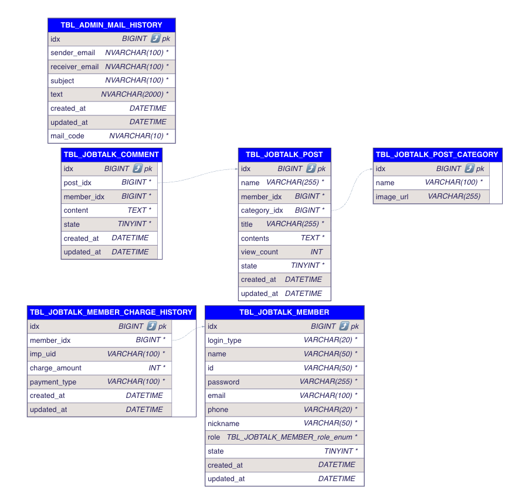

# JobTalk 프로젝트

---

# 📌 목차
- [팀 구성](#팀-구성)
- [프로젝트 개요](#프로젝트-개요)
- [사용 기술](#사용-기술)
- [도메인 구성](#도메인-구성)
- [트러블 슈팅](#트러블-슈팅)

---

# 팀 구성

<table>
  <tr>
    <td align="center">
      <br>
      이의현
    </td>
    <td align="center">
      <br>
      권승준
    </td>
  </tr>
</table>

---

# 프로젝트 개요
- 블라인드 기반 기업 리뷰/커뮤니티 서비스
## 개발 기간
- 2025.08 ~ 2025.09
## 목적
- 사용하지 않았던 기술 학습 (Kafka, ReplicationDB)
## 핵심 기능
- Kafka 기반 메시지 서비스
- Replication DB: Master/Slave 읽기/쓰기 분리
- RefreshToken/AccessToken 기반 회원 관리 보안

---

# 사용 기술

- Java 
- Springboot
- Kafka
- iamport
- Replication DB
- Jpa
- Mysql
- Webflux
- QueryDsl

---

## ERD


---

## 패키지 구조

```
backend
├── common              # 공통 모듈 (설정, 예외, 보안, 유틸 등)
│   ├── config          # Spring / Redis / JPA / Web 설정
│   ├── dto, entity     # 공통 DTO 및 BaseEntity
│   ├── exception       # 전역 예외 처리
│   ├── security, filter, jwt  # JWT 인증/인가 로직
│   ├── kafka           # Kafka 관련 설정 및 메시지 DTO
│   └── util, webclient # RedisService, 내부 WebClient 등
│
└── domain              # 도메인별 계층 구조
    ├── member          # 회원가입, 로그인, 권한 관리
    ├── mail            # 이메일 발송 및 이력 관리
    ├── payment         # 결제 내역, 결제 인증 로직
    ├── post            # 게시글 및 댓글 CRUD
    └── postcategory    # 게시글 카테고리 관리

```
---

# 도메인 구성
기존 모놀리스 기반의 개발에서 메시징 기반의 서비스로 전환하는 과정에서 도메인을 분리하였습니다.
- mail, member, payment, post, postcategory 도메인으로 나누어 도메인별 기능을 완전히 분리할 수 있었습니다.

---

# 트러블 슈팅

LocalDateTime 역직렬화 트러블 슈팅 (WebClient 요청)

- 프로젝트를 분산환경이라 가정하고 진행하는 과정에서 특정 도메인의 정보를 조회하는 과정에서 WebClient를 사용하였습니다. 그러나 WebClient를 사용할 때 LocalDateTime이 포함되어 있는 데이터를 사용하면 `java.time.LocalDateTime not supported by default:...` 라는 에러가 발생했습니다.
- 이를 해결하기 위해서 WebClient Config 파일에서 ObjectMapper을 의존성 주입(DI)하여 문제를 해결했습니다.
```
// 변경 전
public BaseInternalWebClient(@Qualifier("internalWebClient") WebClient baseWebClient) 

// 변경 후 
public BaseInternalWebClient(@Qualifier("internalWebClient") WebClient baseWebClient, ObjectMapper objectMapper)
```
